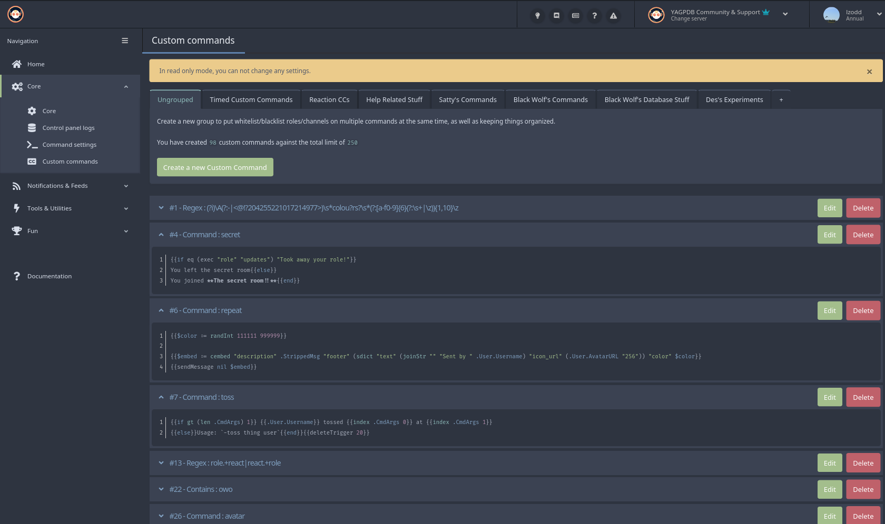

# YAG-Nord

Custom CSS for the [YAGPDB control panel](https://yagpdb.xyz/manage)
following the [Nord](https://www.nordtheme.com/docs/colors-and-palettes/) palette.



## Information

This stylesheet was developed and tested with Firefox, as that browser has
excellent support for injecting your own CSS via `userContent.css`.

It has also been reported to work on Chrome and Chromium. (This list might be
expanded in future).

## Installation

### Firefox

1. If you haven't already, navigate to `about:config` and set<br/>
    `toolkit.legacyUserProfileCustomizations.stylesheets` to `true`.<br/>

2. Open `about:profiles` and open the root directory of the currently active<br/>
   profile. Create a `chrome` folder in there.

3. Create the file `userContent.css` inside the newly created folder and copy<br/>
   the contents of the [yagpdb_nord.css](yagpdb_nord.css) file into it.<br/>

4. Save and restart Firefox.

### Google Chrome / Chromium

##### No Native Solution

Google Chrome / Chromium does not support user styles like Firefox does.
[This is deliberate](https://bugs.chromium.org/p/chromium/issues/detail?id=347016).

Further this breaks accessibility standards and the CSS specification,
but we all know how much Google actually cares about their users : )

##### However, there is a workaround:

1. Install the [Stylus extension](https://chrome.google.com/webstore/detail/stylus/clngdbkpkpeebahjckkjfobafhncgmne).

2. Manage the stylus extension<br/>
    (click the puzzle thingy next to the search bar, select Stylus and click `Manage` in its menu.)

3. Click `Write New Style` on the left side-panel.

4. Click `Import`, paste the contents of the [yagpdb_nord.css](yagpdb_nord.css)
   file into it, and select `Overwrite Style`.

5. Save and restart Chrome.

## Contributing

If you would like to report other working browsers, add a new section
`Browsername` under *Installation*. If applicable, describe the modifications
necessary to make it work, or submit a patch file for users to apply.

### IMPORTANT, READ THIS OR YOUR PR / ISSUE GETS CLOSED

If you're just here to open a PR or issue about how many `!important` directives
there are, **don't**. 

I'm not going to change this, and I'm not going to accept any PRs that change it
either. This is intended for `userContent.css`, thus this `!important` spam is
really kind of necessary.

### Submitting Code

The commit header is mandatory and should summarize the change. "Update README"
is not an acceptable header, nor is "magic". Please try to keep it below 50
characters.

If 50 characters are not enough, and you want to add more detail, add a commit
body, like so:

```
(commit header)
<blank line>
(Commit body)
```

Secondly, your change should be useful: though fixing typos is appreciated, if
that's the sole content of your PR I'm going to reject it and push the change
myself. However, if you do touch up some code and in parallel fix a few
***adjacent*** typos, go ahead.

If your change is purely code, please try to stick to the current format present
in the CSS file. If your IDE of choice does something weird to the code,
like automatically formatting, or changing tabs, tabs width, or *anything like
that*, fix your IDE, not the code.

Lastly, and this is the most important requirement: You must be willing to waive
any and all copyright on your submission. This """project""" is released into
the public domain, and thus all contributions are released into the same as well.

## License

yag-nord is released into the public domain. See the [LICENSE.md](LICENSE.md)
file for more details.
